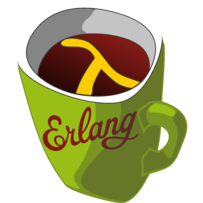
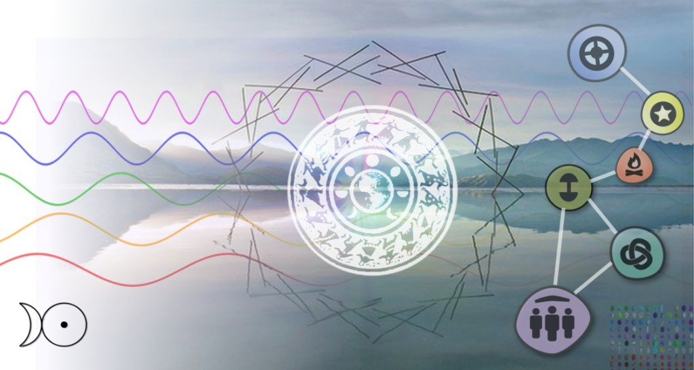

#HSLIDE
## Защо Elixir?

#HSLIDE


#HSLIDE
## Няколко факта за езика:


#HSLIDE
* Езикът се ползва някъде от 2013 година, което го прави доста млад, тепърва
  има да набира популярност.

#HSLIDE
* Създателят на Elixir, Хосе Валим (José Valim) идва от ruby/rails света. Това
  малко или много се е отразило на синтаксиса на езика.

#HSLIDE
* Elixir върви на виртуалната машина на Erlang и може да ползва всичко написано
  на Erlang. Това се отразява добре на бързината и конкурентността му. Като
  цяло не е твърде далеч от истината да кажем че е по-човешки Erlang.

#HSLIDE
* Подобно на Ruby си има web framework - Phoenix, съпоставим на Rails по начин
  на писане, но не и по производителност, в положителния смисъл.

#HSLIDE
* Функционален език е. Това е голям плюс когато става въпрос за конкурентност.
  Също малко или много ще преобърне представите ви за програмиране.

#HSLIDE
**Elixir e сравнително нов функционален език, но е построен върху нещо изпитано и направено с цел да се справя добре в конкурентна среда.**

#HSLIDE
## Защо Elixir?
### Защото е функционален език!

#HSLIDE


#HSLIDE
* В Elixir функциите са основните градивни единици.
* Обикновено логиката представлява поредица от композирани функции.

#HSLIDE
Нещо подобно на:

```elixir
[1, 2, 3, 4, 5]
  |> Enum.map(fn n -> n * n end)
  |> Enum.filter(fn n -> n > 10 end)
  |> Enum.reduce(1, &(&1 + &2))

# -> 42
```

#HSLIDE
## Това че Elixir е функционален език значи:

#HSLIDE
### Непроменими (immutable) структури от данни
Tова означава, че ако искаме някаква промяна в дадената структура,
правим нова базирана на старата, с разлика - тази промяна.

#HSLIDE
### Функции без странични ефекти
Колкото и пъти да ги извиквате с едни и същи параметри,
ще връщат същия резултат и няма да променят никакво глобално/локално състояние.

#HSLIDE
### От друга страна езикът не е `pure`
Така че може да има странични ефекти, просто е хубаво да се отбягват.

#HSLIDE
### Функции от по висок ред
Приемащи или връщащи (или и двете) други функции.

#HSLIDE
### Композиция на функции
* Подобно на тези в математиката `F = f(g)` и `F(x) = f(g(x))`.
* Elixir идва с улеснен синтаксис за това `x |> g |> f`.

#HSLIDE
### Рекурсия
Рекурсия се обяснява най-лесно с рекурсия.

#HSLIDE
### Конкурентност и паралелизъм

#HSLIDE


#HSLIDE
## Защо Elixir?
### Защото е Erlang!


#HSLIDE
Тъй като Elixir e млад език е добре да разгледаме
кой и защо ползва основата му - <span style="color:gray; font-size:2em">Erlang</span>.

#HSLIDE
* Amazon - за базата данни SimpleDB
* Yahoo! - за URL bookmarking  <!-- .element: class="fragment" -->
* Facebook - real-time съобщенията  <!-- .element: class="fragment" -->
* WhatsApp - написана на Erlang, real-time съобщения, купена от Facebook  <!-- .element: class="fragment" -->

#HSLIDE
* T-Mobile, Motorola, Ericsson - за SMS услуги и 3G мрежи. Ericsson са създатели на Erlang.
* RabbitMQ - AMQP имплементация  <!-- .element: class="fragment" -->
* CouchDB - популярна база данни  <!-- .element: class="fragment" -->
* Riak - data store  <!-- .element: class="fragment" -->

#HSLIDE
* Разбира се Erlang си има и минусите, да речем няма истински низове и добри инструменти за web разработка.
* Нещо което е допълнено от Elixir.

#HSLIDE
## Защо Elixir?
### Заради хората и проектите около него!

#HSLIDE


#HSLIDE
#### Тук е времето да кажем няколко думи за _Phoenix_.
* Лесен начин за писане на големи лесно-дистрибутирани web приложения.
* Много от плюсовете идващи от основите на Erlang са валидни. <!-- .element: class="fragment" -->
* Лесно е да се достигне до нещо работещо. <!-- .element: class="fragment" -->
* Phoenix има вградена поддръжка на real-time комуникация. <!-- .element: class="fragment" -->
* Също така е и доста по лесен за индивидуализиране от Rails. <!-- .element: class="fragment" -->

#HSLIDE
#### Други важни инструменти са _Mix_ и _Hex_, които позволяват лесна поддръжка на Elixir

#HSLIDE
#### Интересни връзки:
* Добро място за задаване на въпроси или просто четене на мнения е [https://elixirforum.com](https://elixirforum.com)
* Списък с компании които се занимават с Elixir - [https://github.com/doomspork/elixir-companies](https://github.com/doomspork/elixir-companies)
* Библиотеки на Elixir по категории - [https://github.com/h4cc/awesome-elixir](https://github.com/h4cc/awesome-elixir)
* Главна страница на Elixir - [http://elixir-lang.org](http://elixir-lang.org)

#HSLIDE
## Защо Elixir?
### Заради синтаксиса!

#HSLIDE


#HSLIDE
#### Анонимни функции:
* Това е функцията x<sup>2</sup>.

```elixir
fn (x) -> x * x end
```

#HSLIDE
#### Анонимни функции:
* Такава функция може да се извика така:

```elixir
(fn (x) -> x * x end).(3)
# -> 9
```

#HSLIDE
#### Анонимни функции:
* Може да се присвои на променлива:

```elixir
f = fn (x) -> x * x end
f.(3)
# -> 9
```

#HSLIDE
#### Типове:
* Променливите се дефинират без да се задава тип.
* Те си получават типа взависимост от стойността им.

#HSLIDE
#### Типове:

```elixir
5               # -> integer
0x53            # -> integer, the same as 83
5.5             # -> float
false           # -> boolean
:dalia          # -> atom
"elixir"        # -> string
[1, 2, 3]       # -> list
[a: 1, b: 2]    # -> keyword list
{1, 2}          # -> tuple
fn (x) -> x end # function
~r/\d+/         # regular expression
%{a: 1, b: 2}   # map
```

#HSLIDE
#### Типове:
* Списъците в Elixir  са свързани списъци.
* Кортежите се ползват главно за `pattern matching`.
* Erlang няма низове, има списък от букви. Elixir има - UTF-8 низове.
* `'abc'` и `"abc"` са различни типове.
* Атомите са много подобно нещо на символите в Ruby.

#HSLIDE
#### Pattern matching:
```elixir
4 = 4                 # Интерпретира се без грешка
5 = 4                 # Грешка - MatchError
a = 4                 # Няма грешка
4 = b                 # Грешка - променливата b не съществува.
4 = a                 # Успех - а съществува и стойносста ѝ е 4
{d, e, 5} = {7, 6, 5} # Успех, d става 7, e става 6
f = fn
  (5) -> {:ok, 5}
  (x) -> {:error, x}
end
{:ok, x} = f.(5)     # Успех, x получава стойност 5
{:ok, x} = f.(6)     # Грешка, резултатът е {:error, 6}
```

#HSLIDE
#### Модули:
Модулите са колекции от именовани функции.

```elixir
defmodule MyModule do
  def square(x) do
    x * x
  end
end
```

#HSLIDE
#### Процеси:
* Не става дума за OS-ниво процеси.
* Всичко написано на Elixir се изпълнява в процеси.
* Те са изолирани един от друг.
* Много леки откъм ресурси (CPU/RAM).
* Mогат да бъдат хиляди без да натоварват машината на която вървят.

#HSLIDE
#### Процеси:
Процесите в Elixir/Erlang се създават със `spawn`.

```elixir
# Тази функция ще се изпълни в нов процес:
pid = spawn fn -> 2 * 21 end
# pid e от #PID тип.
# Нещо подобно : #PID<0.42.0>

# false, тъй като функцията се изпълнява бързо.
Process.alive?(pid)

# Можем да ползваме pid-а на текущия процес с:
self()
Process.alive?(self()) # true
```

#HSLIDE
#### Процеси:

```elixir
send self(), {:howdy, "Как си?"}

receive do
  {:howdy, message} -> IO.puts(message)
  {_, message} -> IO.puts("Няма значение")
end
# Ще изпечата 'Как си?
```

#HSLIDE
### Защо Elixir?


#HSLIDE
* Защото е модерен, бърз и конкурентен език.
* Защото хората зад и около него са опитни.
* Защото основата му, Erlang, е стабилна и доказана.
* Защото е функционален език.
* Защото е лесен за писане и четене.
* Защото е подходящ за писане и поддръжка на много типове приложения.
* Защото ще разшири кръгозора ви.

#HSLIDE
## Ресурси
* Имаме блог http://blog.elixir-lang.bg
* Имаме Facebook група https://www.facebook.com/groups/636900123169076/
* Имаме mail листа TODO
* Github https://github.com/ElixirCourse

#HSLIDE
## Сега малко информация за курса


#HSLIDE
## Добре дошли!
* Ако сте записали курса за да вземете лесно някоя изборна, ОТПИШЕТЕ ГО, няма да ви е лесно. <!-- .element: class="fragment" -->
* Ако сте записали курса за кредити, ОТПИШЕТЕ ГО, не си заслужав носи само 3,5 кредита. <!-- .element: class="fragment" -->
* Ако смятате, че Обектно ориентираното програмиране е единтвения начин, този курс също не е за вас. <!-- .element: class="fragment" -->

#HSLIDE
## Философия на курс
There will be no foolish wand waving or silly incantations in this class. As such, I don't expect many of you to enjoy the subtle science and exact art that is potion making. However, for those select few, who possess the predisposition, I can teach you how to bewitch the mind and ensnare the senses. I can tell you how to bottle fame, brew glory and even put a stopper in death.

#HSLIDE
## Какво ще трябва да научите в курса
* Elixir <!-- .element: class="fragment" -->
* да мислите и моделирате чрез функции, а не обекти <!-- .element: class="fragment" -->
* да съпоставяте образци :smiley: <!-- .element: class="fragment" -->
* да изпозвате git <!-- .element: class="fragment" -->

#HSLIDE
## Организация на курса
* Курсът ще се провежда всеки Втрник от 18&#58;15 до 21:00.
* Ще се стараем за всяка тема да имаме подробна публикация в блога ни. <!-- .element: class="fragment" -->
* Обикновено на лекция ще имаме презентация, но винаги сме готови да обсъдим нещо, което не е включено в нея. <!-- .element: class="fragment" -->
* Следващият път ще няправим кратък тест с няколко въпроса за програмиране. <!-- .element: class="fragment" -->
* След теста може да бъдете отписани от курса. <!-- .element: class="fragment" -->

#HSLIDE
## Оценяване
* Максимум 100 точки  <!-- .element: class="fragment" -->
  * Неизвестен брой домашни за общо 40 точки
  * Kурсов проект за 40 до 80 точки(спрямо сложносттан най-често 60)
* Допълнителни точки <!-- .element: class="fragment" -->
  * Бонус точки, ако добавите нещо, към някой проект с отворен код свързан с Elixir.
  * Бонус точки за неща, които ние преценим.

#HSLIDE
## Скала за оценяване
Оценнка|2|3|4|5|6|
-|-|-|-|-|-
Точки|0-49|50-57|58-74|75-91|92-100

#HSLIDE

